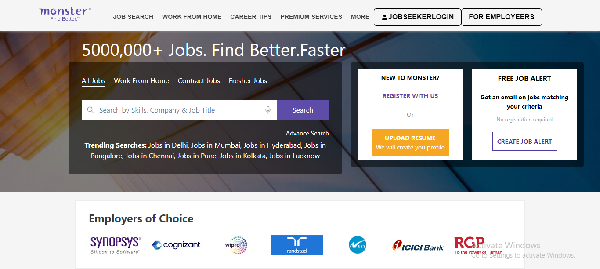
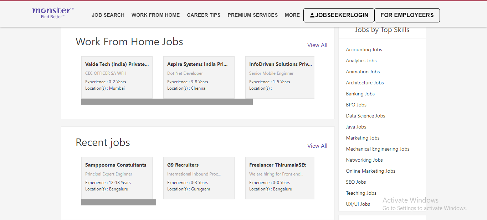
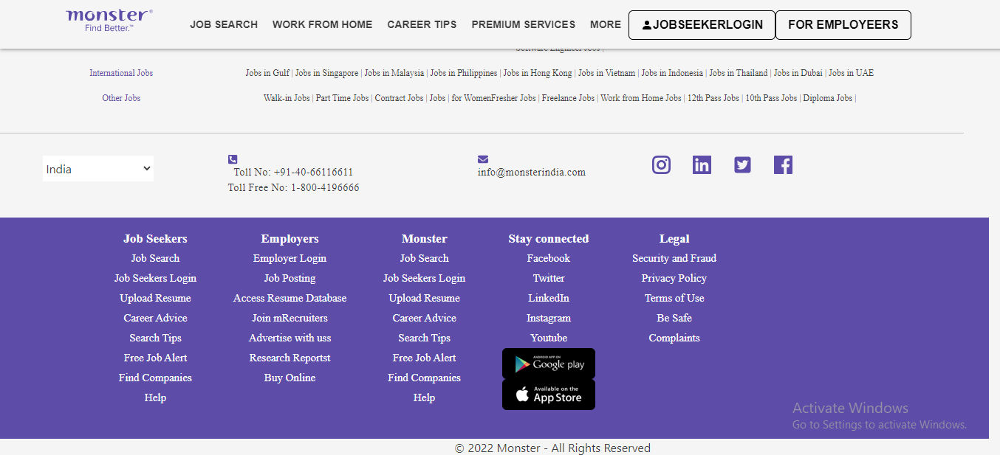
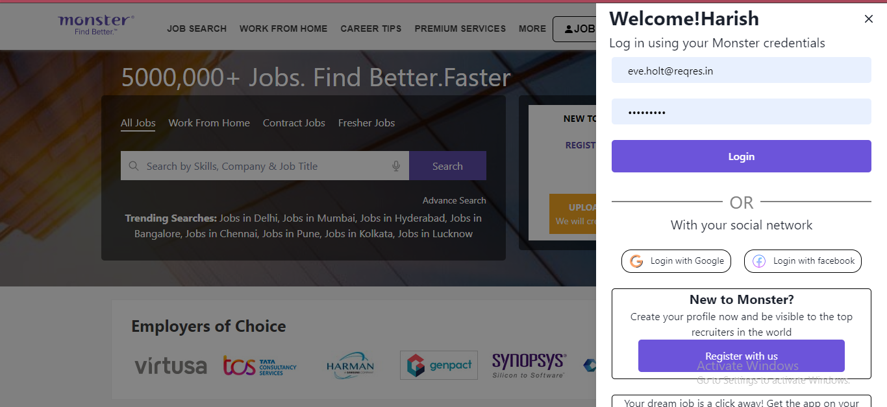
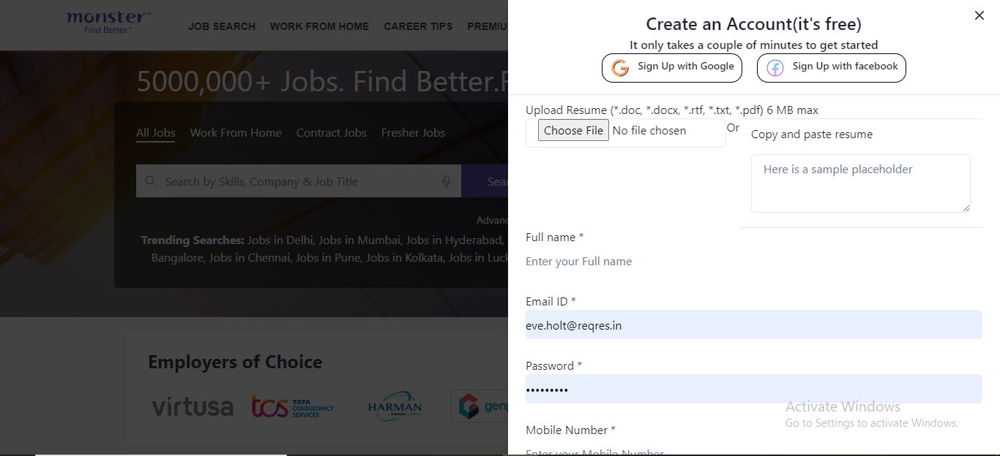
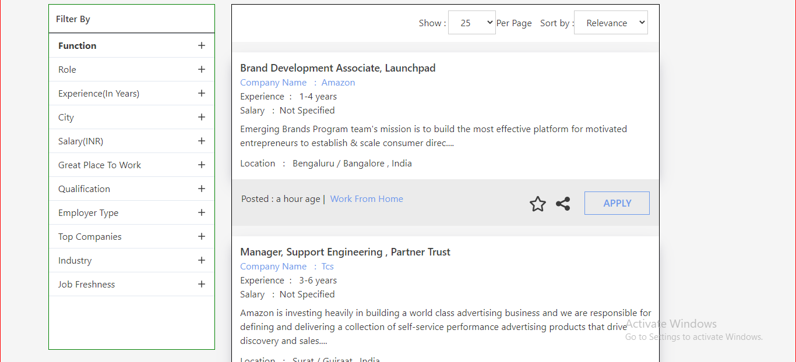
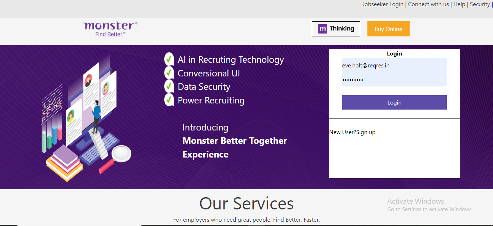
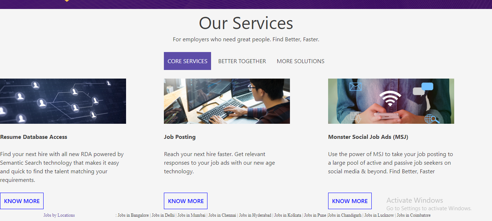

## Monster-jobs

<h2>Github Source:- https://github.com/pankajsajwan12/skinny-pot-4052</h2>

<h3>Monster-jobs is a source for jobs and career opportunities. Search for jobs, read career advice from Monster's job experts, and find hiring and recruiting ...</h3>

<b>This is a team project by Masai school build in a week</b>

<b>Current live project: https://monster-bay.vercel.app/ </b>
<h2>We are the team of 4 Members</h2>
    <ul>
        <li>Pankaj Sajwan</li>
        <li>Raj Kumar</li>
        <li>Harish Rayala</li>
        <li>Gaurav Sharma</li>
    </ul>
<h2>Tech stack used to build this project</h2>
    <ul>
        <li>Html</li>
        <li>CSS</li>
        <li>JavaScript</li>
        <li>React-js</li>
        <li>Chakra-ui</li>
        <li>Redux/React-redux</li>
        <li>React-icons</li>
    </ul>

## Home Page-1

## Home Page-2

## Footer

## Login Page

## Register

## Work-From-Home

## For Employeers-1

## For Employeers-2

